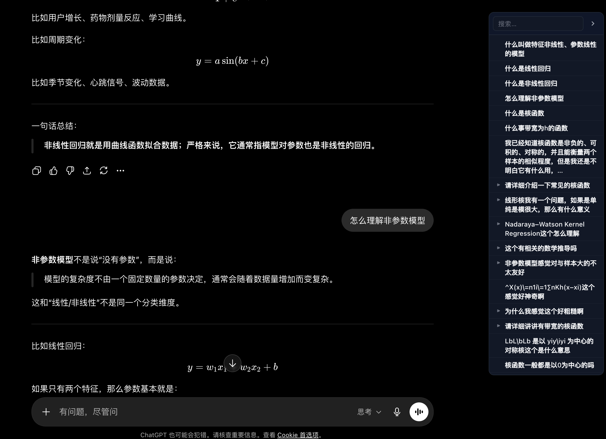

# Chat Indexer

为 AI 聊天页面生成右侧目录，帮助你整理较长回答的文章结构，并在长对话里快速回看问题、跳转上下文、搜索重点内容。

当前版本：`1.2.1`

适合这些场景：

- 整理较长回答的文章结构（快速看到章节层级）
- 你经常和 ChatGPT、DeepSeek、Gemini、Kimi 长对话
- 你想快速回到某一轮提问或某一段回答
- 你不想在一整页聊天记录里反复滚动查找
- 你想把完整对话导出成 Markdown 或 PDF 归档

## 效果展示



## 下载

请从 GitHub Releases 下载最新版安装包：

- [下载最新版本](https://github.com/lingchuan2024/Chat-Indexer/releases/latest)

## 功能

- 自动按对话轮次生成目录
- 自动提取回答中的 `h1`-`h4` 标题层级
- 点击目录快速跳转到对应位置
- 支持一键返回上一个阅读位置
- 支持目录搜索，可匹配问题、标题和回答内容
- 支持当前阅读位置高亮
- 支持折叠 / 展开目录
- 支持调整面板宽度和位置
- 支持手动刷新目录并清理当前会话缓存
- 支持导出当前对话为 Markdown
- 支持导出当前对话为 PDF（通过浏览器打印能力生成）
- 自动记住面板宽度、位置和显示状态
- ChatGPT 支持读取会话接口补全长对话目录，并缓存最近会话目录

## 支持平台

当前兼容情况：

| 平台     | 地址                                                                 | 状态       |
| -------- | -------------------------------------------------------------------- | ---------- |
| ChatGPT  | `chatgpt.com` / `chat.openai.com`                                | 较稳定     |
| DeepSeek | `chat.deepseek.com`                                                | 持续优化中 |
| Gemini   | `gemini.google.com`                                                | 持续优化中 |
| Kimi     | `www.kimi.com` / `kimi.com` / `kimi.ai` / `kimi.moonshot.cn` | 持续优化中 |

说明：

- ChatGPT 目前相对稳定
- DeepSeek、Gemini、Kimi 仍在持续适配页面结构变化
- 如果某个平台显示异常，欢迎提 Issue 或附截图反馈

## 安装方法

### Chrome / Edge

1. 打开 [最新 Release](https://github.com/lingchuan2024/Chat-Indexer/releases/latest)
2. 下载最新的扩展安装包 `zip`
3. 解压 `zip`
4. 打开浏览器扩展页面
   - Chrome: `chrome://extensions/`
   - Edge: `edge://extensions/`
5. 打开右上角 **开发者模式**
6. 点击 **加载已解压的扩展程序**
7. 选择刚才解压后的文件夹
8. 打开支持的 AI 对话页面，右侧会出现目录面板

## 使用说明

安装成功后，页面右侧会出现目录面板。

你可以这样用：

- 点击目录项：跳转到对应提问
- 点击顶部返回按钮：回到跳转前的阅读位置
- 点击刷新按钮：重新扫描当前页面；在 ChatGPT 页面会同时清理当前会话缓存并尝试重新读取会话数据
- 点击导出按钮：选择导出 Markdown 或 PDF
- 点击左侧箭头：展开或折叠该轮回答里的标题
- 使用搜索框：筛选问题、标题和回答内容
- 拖动左边缘：调整目录宽度
- 拖动顶部：调整目录位置
- 点击折叠按钮：临时隐藏目录

### 导出说明

- Markdown 导出会尽量保留标题、段落、列表、引用、代码块和链接
- PDF 导出会打开打印窗口，你可以选择保存为 PDF
- 导出文件名会使用当前对话标题和导出时间生成
- 如果页面使用虚拟列表，建议先滚动到需要导出的内容附近，或先点击刷新按钮

## 常见问题

### 安装后没有看到目录

请先检查：

- 你打开的是支持的网站
- 扩展已经成功加载
- 页面已经刷新过一次
- 你加载的是解压后的扩展文件夹，而不是 zip 文件本身

### 目录缺少较早的 ChatGPT 历史内容

ChatGPT 页面会优先尝试读取当前会话数据来补全目录。如果浏览器未登录、接口返回失败，或页面结构发生变化，扩展会退回到页面 DOM 扫描。

可以尝试：

- 确认当前浏览器已经登录 ChatGPT
- 点击目录顶部刷新按钮
- 刷新页面后再次打开该对话

### 某个平台目录不准确、重复，或者显示异常

这是因为不同网站的页面结构变化较快。

目前：

- ChatGPT 较稳定
- DeepSeek、Gemini、Kimi 仍在持续优化

如果你愿意反馈，请尽量附上：

- 浏览器截图
- 出问题的网址
- 浏览器版本
- 对应消息节点的 HTML 或开发者工具截图

### 更新版本后怎么升级

1. 下载最新 Release
2. 删除旧版本 zip 并解压新版本
3. 在扩展页面重新加载，或移除旧版本后重新添加

## 反馈

如果你遇到兼容问题，欢迎提交 Issue：

- [提交 Issue](https://github.com/lingchuan2024/Chat-Indexer/issues)

建议附带：

- 出问题的平台
- 问题截图
- 出问题页面的网址
- 复现步骤

## 版本发布

所有可下载版本请查看：

- [Releases](https://github.com/lingchuan2024/Chat-Indexer/releases)

## 开发说明

这是一个 Manifest V3 内容脚本扩展，主要文件如下：

```text
├── manifest.json
├── content.js
├── platforms.js
├── scanner.js
├── renderer.js
├── exporter.js
├── layout.js
├── utils.js
├── content.css
├── page-bridge.js
├── tests/
└── icons/
```

文件职责：

- `manifest.json`：扩展清单、匹配站点、脚本加载顺序
- `platforms.js`：不同 AI 平台的选择器、角色识别和滚动容器配置
- `scanner.js`：扫描页面消息、构建目录数据、管理 ChatGPT 会话缓存
- `renderer.js`：渲染目录、处理跳转、返回上一阅读位置和当前项高亮
- `exporter.js`：导出 Markdown / PDF
- `layout.js`：侧边栏、搜索框、按钮、拖拽、缩放和显示状态
- `content.js`：入口初始化、SPA 路由变化监听和刷新流程
- `page-bridge.js`：在 ChatGPT 页面内辅助读取会话接口数据

### 本地开发

1. 修改代码后打开浏览器扩展页面
2. 点击该扩展的重新加载按钮
3. 刷新目标 AI 对话页面
4. 在页面右侧检查目录面板行为

### 运行测试

项目使用 Node.js 内置测试运行器，不需要额外依赖：

```bash
node --test tests/logic.test.js
```
